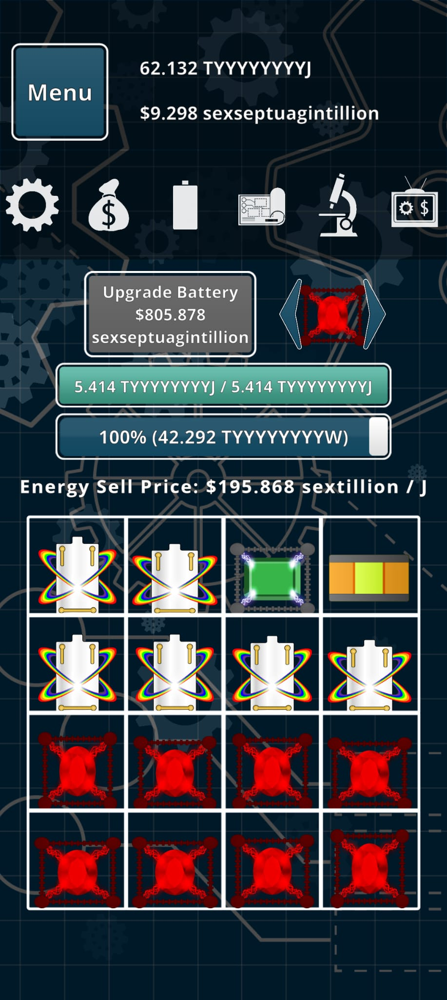

# Architecture — Idle Power Helper

## Why this architecture exists

Android imposes a hard security boundary: a regular app cannot inject touch events into another app, and cannot read another app's screen pixels. Idle Power Helper works around both restrictions without requiring root:

| Restriction | Android's official escape hatch |
|---|---|
| Cannot touch another app | **Accessibility Service** — lets a registered service inject `GestureDescription` events system-wide |
| Cannot read another app's screen | **MediaProjection** — a foreground service can ask the user for a one-time screen-capture grant and then receive a live pixel feed |
| Must stay alive while the game runs | **Foreground Service** — keeps the process alive and shows a persistent notification |
| Must draw on top of other apps | **`SYSTEM_ALERT_WINDOW`** — lets the app place a `TYPE_APPLICATION_OVERLAY` window above everything |

Because an Accessibility Service and a regular Foreground Service are two separate Android component types that cannot be merged into one, the app runs them side-by-side and bridges them with a static reference.

---

## Component map

```
┌─────────────────────────────────────────────────────────────────────┐
│ User's phone                                                        │
│                                                                     │
│  MainActivity  ──(1) requests screen-capture grant──▶ Android OS   │
│       │                resultCode + Intent ─────────────────────┐  │
│       └──(2) startForegroundService()──▶ OverlayService         │  │
│                                               │   ◀─────────────┘  │
│                         (3) MediaProjection ──┤                     │
│                         (4) WindowManager  ───┤── floating panel    │
│                         (5) coroutine loop ───┤                     │
│                                               │                     │
│                      BatteryMerger  ◀──(6)────┤  analyzeGrid()      │
│                                    ──(7)────▶ │  findBestMerge()    │
│                                               │                     │
│                      SwipeAccessibilityService│                     │
│                             .instance ◀──(8)──┘  performSwipe()     │
│                                               │                     │
└─────────────────────────────────────────────────────────────────────┘
```

**Step-by-step startup:**

1. `MainActivity` calls `MediaProjectionManager.createScreenCaptureIntent()`. Android shows a system dialog; the user taps *Start now*.
2. The `resultCode + Intent` (a one-time capability token) is passed to `OverlayService` via `startForegroundService()`. Without this token the service cannot capture the screen.
3. `OverlayService.setupCapture()` creates an `ImageReader` and a `VirtualDisplay` wired to it. Every time the screen updates, a new frame is available in the `ImageReader`'s buffer.
4. `OverlayService.showOverlay()` uses `WindowManager.addView()` with `TYPE_APPLICATION_OVERLAY` to place the floating control panel.
5. When the user taps **▶ Start**, a coroutine loop starts on `Dispatchers.Default`.
6–7. Each loop iteration calls `BatteryMerger.analyzeGrid()` then `BatteryMerger.findBestMerge()`.
8. The chosen move is forwarded to `SwipeAccessibilityService.instance.performSwipe()`.

---

## The overlay system

### Two windows, one service

`OverlayService` manages two `WindowManager` windows:

| Window | Purpose | Flags |
|---|---|---|
| `overlay_panel` (XML layout) | The draggable control panel the user interacts with | `FLAG_NOT_FOCUSABLE` so touches pass through to the game except on the panel itself |
| `GridDebugView` (custom `View`) | Fullscreen transparent canvas drawn on top of everything | `FLAG_NOT_FOCUSABLE \| FLAG_NOT_TOUCHABLE \| FLAG_LAYOUT_IN_SCREEN` — fully invisible to touch |

### Drag-to-move

The floating panel is draggable because `OverlayService.makeDraggable()` attaches a `OnTouchListener`:

- `ACTION_DOWN`: records the raw pointer position and the current `WindowManager.LayoutParams.x/y`.
- `ACTION_MOVE`: computes the delta from the `DOWN` position and updates `params.x/y`, then calls `windowManager.updateViewLayout()`.

Note that in `TYPE_APPLICATION_OVERLAY` windows, `gravity = TOP | END` and the `x` parameter is measured **from the right edge** (not the left), so `params.x = startPx + (startRawX - ev.rawX)`. The sign is inverted relative to what you might expect.

### Why `FLAG_NOT_FOCUSABLE`?

Without this flag, the floating window would steal keyboard focus from the game below it. With it, the window still receives touch events on its own area but does not intercept anything outside its bounds.

### Thread model for UI updates

`OverlayService`'s merge loop runs on `Dispatchers.Default`. Every write to a `View` (e.g. updating the status text, changing the button label) must jump back to the main thread:

```kotlin
Handler(Looper.getMainLooper()).post {
    overlayView?.findViewById<TextView>(R.id.tv_status)?.text = text
}
```

The `GridDebugView` is updated via `postInvalidate()`, which is thread-safe and schedules a redraw on the main thread.

---

## The swipe algorithm

### Overview

Each iteration of the merge loop does the following:

```
capture screen → analyzeGrid() → findBestMerge()
                                      │
                      match found ────┤──── no match
                           │                    │
                     smart swipe           sweepMove()
                           │                    │
                     performSwipe() ◀───────────┘
                           │
                        delay()
```

### `analyzeGrid()` — reading the board

The 4×4 grid is divided into cells using `GridBounds`:

```
cellWidth  = (right  - left) / 4
cellHeight = (bottom - top)  / 4
```

For each cell the sampler avoids the grid lines by only reading the **inner 40%** of the cell (the 30–70% band both horizontally and vertically). It then walks that sub-region in 3-pixel steps, accumulates `R`, `G`, `B` sums, and computes an average. Stepping by 3 pixels rather than 1 is a performance trade-off: 16 cells × ~(0.4 × cellWidth/3) × (0.4 × cellHeight/3) samples is fast enough for 350 ms loop intervals.

The averaged colour is classified by `bucketColor()` (see [Color bucketing](#color-bucketing)) into a small integer **type ID**. Cells whose average brightness is below 35/255 are classified as empty (type `-1`).

### `findBestMerge()` — choosing the best move

All cells are grouped by type. Any type with fewer than 2 cells is skipped. For every pair of same-type cells a score is computed:

```
score = orthogonalBonus + rarity × 100 − distToCorner × 10 − swipeLength
```

| Term | Value | Rationale |
|---|---|---|
| `orthogonalBonus` | 200 if same row or same column, else 0 | Diagonal drags are unreliable in the game engine; same-axis moves almost always land correctly |
| `rarity × 100` | `(16 / count) × 100` | Batteries with fewer duplicates are higher-tier; merge the rarest ones first to avoid wasting a slot |
| `distToCorner × 10` | Manhattan distance of the *destination* cell to `(0, 3)` | The app funnels the best battery towards the top-right corner so it doesn't get accidentally merged away |
| `swipeLength` | `|Δrow| + |Δcol|` | Prefer shorter swipes to reduce the chance of overshooting |

The destination cell of a move is always the one **closer** to corner `(0, 3)`. This means the better battery advances towards the corner with every merge.

**Example** (from the screenshot below): rows 2 and 3 each contain four red batteries. Any of the 6 red pairs within the same row scores: orthogonal bonus (200) + rarity (16/8 × 100 = 200) − dist-to-corner − swipe-length. The pair `(2,3)→(3,3)` scores 200+200−(1+0)×10−1 = **389**, the highest in that group because `(2,3)` is one step from the top edge and `(3,3)` is directly below it (short swipe, good destination position).

### `sweepMove()` — fallback

When no matching pair exists (the board is in a fully mismatched state), the app cycles through a precomputed 24-move sequence:

1. **Upward pass** (12 moves): every cell in rows 3, 2, 1 is pushed one row up.
2. **Rightward pass** (12 moves): every cell in columns 0, 1, 2 is pushed one column right.

This keeps the board churning and tends to surface new matches. `sweepIter` increments each time a sweep move is used and resets to 0 when the loop starts, so the sequence always begins from row 3 upward.

### Performing the swipe

`executeSwipe()` is a `suspend` function. It uses `suspendCoroutine` to bridge the callback-based `dispatchGesture()` API:

```kotlin
suspendCoroutine { cont ->
    Handler(Looper.getMainLooper()).post {           // must be on main thread
        svc.performSwipe(fromX, fromY, toX, toY) {
            cont.resume(Unit)                        // resume when gesture completes
        }
    }
}
```

The coroutine suspends until the gesture callback fires (`onCompleted` or `onCancelled`), ensuring the delay between moves starts *after* the swipe finishes, not before.

`SwipeAccessibilityService.SWIPE_DURATION_MS = 180` — this is the simulated finger-drag time. Too fast and the game may not register the merge; too slow and the 350 ms fast-mode interval becomes a bottleneck.

---

## Color bucketing

### The problem

Battery types in *Idle Power* are distinguished by colour. The app cannot know a battery's numeric tier; it can only see pixels. Two cells should be considered the same type if and only if they show the same battery colour, regardless of animation frames or minor rendering variation.

### The algorithm

```
RGB average of inner 40% of cell
        │
        ▼
   brightness = (R+G+B)/3 < 35 ?  →  type -1  (empty / background)
        │
        ▼
   convert to HSV
        │
    saturation < 0.22  OR  value < 0.20 ?  →  type 100  (achromatic)
        │
        ▼
   type = (hue / 30).toInt() × 30          →  0, 30, 60, 90, 120, 150,
                                               180, 210, 240, 270, 300, 330
```

**Why HSV instead of RGB?** Human perception (and the game's colour palette) groups battery types by *hue*. Two red batteries will have very different RGB values when one is in shadow or animated, but their hue stays close to 0°. HSV separates "what colour is it" (hue) from "how bright/vivid" (saturation, value), making the bucketing robust.

**Why bucket in 30° steps?** 360° / 30° = 12 buckets — enough to distinguish every distinct battery colour in the game while tolerating ±15° of hue noise from anti-aliasing, reflections, and animation. A 15° bucket would over-split; a 60° bucket would merge yellow with green.

**Why type 100 for achromatic?** White, silver, and the rainbow "prismatic" batteries all have low saturation. They are grouped together regardless of their hue because at low saturation the hue value is numerically unstable (a near-white pixel can report any hue). In the game they represent the same very-high-tier battery class, so merging them together is correct.

### Example: the screenshot



Annotated grid (row 0 = top, col 0 = left):

```
         col 0         col 1         col 2         col 3
row 0  [rainbow]     [rainbow]     [green]       [orange/AA]
row 1  [rainbow]     [rainbow]     [rainbow]     [rainbow]
row 2  [red]         [red]         [red]         [red]
row 3  [red]         [red]         [red]         [red]
```

Colour analysis for each battery type:

| Battery | Dominant colour | Approx. hue | Saturation | Bucket result |
|---|---|---|---|---|
| Rainbow / prismatic (rows 0–1) | White with multicolour wings | varies | **< 0.22** (white centre dominates the sample) | **type 100** (achromatic) |
| Green (row 0, col 2) | Vivid green | ≈ 120° | high | **(120 / 30) × 30 = type 120** |
| Orange/AA (row 0, col 3) | Orange-yellow | ≈ 35° | high | **(35 / 30) × 30 = type 30** |
| Red (rows 2–3) | Deep red | ≈ 5° | high | **(5 / 30) × 30 = type 0** |

**What the algorithm would do with this board:**

1. **Type 100 (rainbow):** 6 cells — `(0,0)`, `(0,1)`, `(1,0)`, `(1,1)`, `(1,2)`, `(1,3)`. Rarity = 16/6 ≈ 2.67, factor = 267.
2. **Type 0 (red):** 8 cells — all of rows 2 and 3. Rarity = 16/8 = 2, factor = 200.
3. **Type 120 (green):** 1 cell — no match possible.
4. **Type 30 (orange):** 1 cell — no match possible.

The algorithm picks the **rainbow pair with the highest score**. Among all same-row rainbow pairs, `(1,2)→(1,3)` wins: col 3 is the target column, so `distToCorner((1,3)) = 1`, orthogonal bonus applies, swipe length = 1.

```
score = 200 (orthogonal) + 267 (rarity) − 1×10 (dist to corner) − 1 (swipe) = 456
```

The resulting merged battery lands at `(1,3)`, one step closer to corner `(0,3)`.

---

## GridBounds and coordinate system

All grid math uses **absolute screen pixels**, never dp or percentages. `GridConfig` stores and loads a `GridBounds(left, top, right, bottom)`.

```
screen (0,0)
  ┌──────────────────────────────┐
  │                              │
  │   GridBounds.left            │
  │   ◄──────────►               │
  │   ┌──────────────────┐       │  ◄── GridBounds.top
  │   │ (0,0)│(0,1)│...  │       │
  │   │──────┼─────┼──── │       │
  │   │ (1,0)│     │     │       │
  │   │──────┼─────┼──── │       │
  │   │ ...  │     │     │       │
  │   └──────────────────┘       │  ◄── GridBounds.bottom
  │                              │
  └──────────────────────────────┘
```

`cellCenter(row, col)` returns the pixel coordinate of the exact centre of a cell — this is where the swipe starts and ends.

The **default bounds** assume a 1080 × 2400 device and map to approximately:
- Left: 43 px, Right: 1037 px (4%–96% width)
- Top: 1128 px, Bottom: 2304 px (47%–96% height)

The in-app sliders in `MainActivity` and the nudge buttons in the overlay both write `GridBounds` values back through `GridConfig.save()`.
